Übersicht der Browser
Add-Ons und Installation

der Erweiterungen
für Dragon 2025

Thax Software GmbH · Halberstädter Str. 6 · 10711 Berlin

**Übersicht der Browser Add-Ons
und Installation der Erweiterungen
für Dragon 2025**

24.07.2025

Inhalt

import TOCInline from '@theme/TOCInline';

<TOCInline toc={toc} />

## Vorwort und Empfehlung geeigneter Web-Browser

Wir empfehlen die Verwendung des Microsoft-Browsers Edge, da hier die Verfügbarkeit der Add-Ons für nahezu alle Dragon-Versionen gegeben ist. Auch der Google Chrome Browser unterstützt die neuesten Dragon-Versionen.

Das Add-On für die bereits seit Januar 2023 eingestellte Dragon Medical Practice Edition (DMPE) wird von aktuellen Browsern nicht länger unterstützt. Ein Add-On gibt es aber für das Nachfolgeprodukt Dragon Medical One (DMO).

Für Mozilla Firefox und Apple Safari Browser sind generell keine Erweiterungen mehr für die Dragon Spracherkennung verfügbar. Es gab zwar bis ca. 2023 ein Dragon-Add-On für Mozilla Firefox, dieses wird aber nicht mehr angeboten, da es vom Mozilla Firefox Browser blockiert wurde.

Für eine stabile und sichere Verwendung nutzen Sie daher am besten den Edge- oder Chrome-Browser und installieren das für Ihre Dragon-Edition passende Add-On.

Hinweis: Melden Sie sich zuvor in Ihrem Browser an oder erstellen ein Nutzerprofil. Im Gast-Modus oder im Private-/Inkognito-Modus können die Erweiterungen nicht installiert werden. Hier dargestellte Screenshots sind exemplarisch und können von Ihren tatsächlichen Browser-Einstellungen abweichen.

## Dragon Weberweiterung für Dragon Professional Group (DPG) und Dragon Legal Group (DLG) ab v15.7.1 sowie Dragon Professional v16 und Dragon Legal v16

## Beschreibung des Add-On

- Dragon Professional Group (DPG) und Dragon Legal Group (DLG) ab Version 15.7.1, auch für Dragon Professional 16 und Dragon Legal 16 oder höher
- Version 15.7.100.1674, wurde aktualisiert 23. Oktober 2024

Diese Browser-Erweiterung ermöglicht das volle Potenzial von Dragon Professional
und Dragon Legal:

- Verbessertes Diktieren und Bearbeiten (dort klicken, wo der Text erscheinen soll, und dann sprechen).
- Elementnamen per Sprache anklicken, zum Beispiel sagen Sie „Klick Kontakt“.

### Installation in Microsoft Edge

- Klicken Sie im Browserfenster von Edge rechts oben auf das 3 Punkte Menü (…) und wählen den Menüpunkt „Erweiterungen“.

- Es öffnet sich ein kleines Fenster, dort klicken Sie auf den Link „Erweiterungen für Microsoft Edge“ abrufen“

- Geben Sie auf der Microsoft Edge Add-Ons-Website in die Suche „Dragon Web“ ein.

- Als Suchergebnis wird die Dragon Weberweiterung angezeigt, klicken Sie dort auf die Schaltfläche „Abrufen“

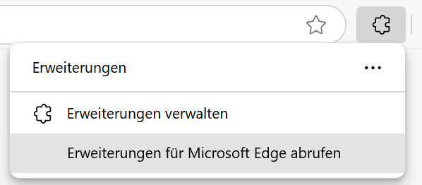

- Bestätigen Sie die folgende Abfrage mit der Schaltfläche „Erweiterung hinzufügen“.

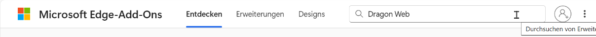

- Die Dragon Weberweiterung wird installiert und Sie erhalten eine Bestätigung.

### Installation in Google Chrome

- Klicken Sie im Google Chrome-Browserfenster rechts oben auf das 3 Punkte Menü (…) und wählen den Menüpunkt „Erweiterungen“. Im weiteren Popup klicken Sie auf den Link „Chrome Web Store besuchen“.

- Im Chrome Web Store geben Sie links oben in die Suche „Dragon Weberweiterung“ ein. Als Suchergebnis wird die Dragon Weberweiterung angezeigt, klicken Sie dieses Suchergebnis an.

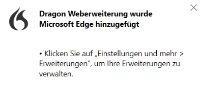

- Klicken Sie nun auf „Hinzufügen“.

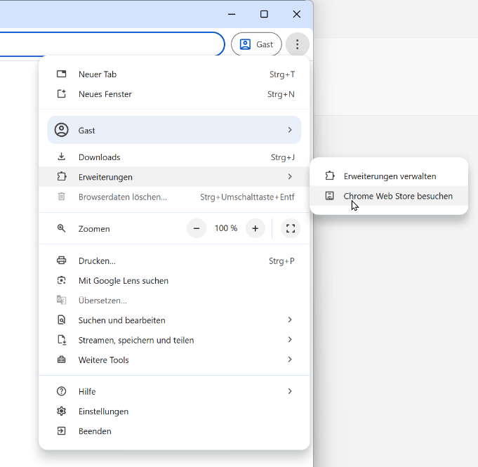

- Bestätigen Sie die folgende Abfrage mit der Schaltfläche „Erweiterung hinzufügen“.

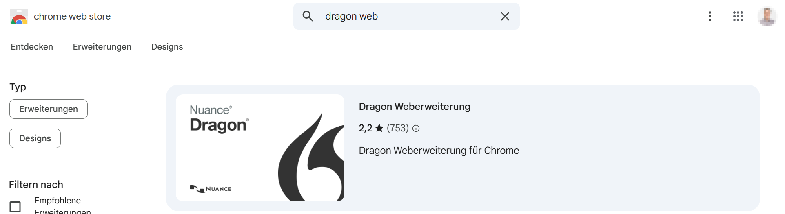

- Die Dragon-Weberweiterung wird im Google Chrome Browser installiert und Sie erhalten eine Bestätigung.

# Dragon Weberweiterung für Dragon Medical One (DMO), Dragon Medical Direct (DMD), Dragon Professional Anywhere (DPA), Dragon Legal Anywhere (DLA)

## Beschreibung des Add-On

- Version 24.3.1219.0, wurde aktualisiert 27. Juni 2024

Mit dieser Browser-Erweiterung können Sie die Dragon-Cloudvarianten in Edge und Chrome noch effektiver nutzen. Für die Dragon (DMO, DMD, DPA, DLA) Web Extension ist eines der folgenden Produkte erforderlich:

- Dragon Medical One (DMO) 2022.1 oder höher
- Dragon Medical Direct (DMD) 2022.1 oder höher
- Dragon Professional Anywhere (DPA) 2022.1 oder höher
- Dragon Legal Anywhere (DLA) 2022.1 oder höher

Neu in Version 24.3.1219.0

- Wenn Benutzer mit dem Rich-Text-Editor von TinyMCE arbeiten, werden die Zeilenabstände für neue Zeilen und Absätze nun nicht mehr verdoppelt.
- Für die Anmeldung bei MEDITECH Expanse können Benutzer nun die Okta SSO-Multifaktor-Authentifizierung in Google Chrome verwenden.

Neu in Version 23.2.897.0

- Ein Upgrade von TrakCare unterbricht nun nicht mehr das Diktat der Benutzer; das Diktat geht direkt in die EPA.
- Die Sprachbefehle 'rückgängig machen' und 'wiederhol das' funktionieren nun wie erwartet.

Neu in Version 22.4.845.0

- Google aktualisiert sein Framework für Erweiterungen; daraus folgt, dass Chromium-basierte Microsoft Edge Erweiterungen ihre Manifest-Version aktualisieren müssen. Diese Version der Dragon (DMO, DMD, DPA, DLA) Web Extension unterstützt das Upgrade.
- Benutzer können nun in TrakCare-Fenster diktieren, die auf einer Seite mehrere CKEditor-Felder enthalten.

### Installation in Microsoft Edge

- Klicken Sie im Browserfenster von Edge rechts oben auf das 3 Punkte Menü (…) und wählen den Menüpunkt „Erweiterungen“.
- Es öffnet sich ein kleines Fenster, dort klicken Sie auf den Link „Erweiterungen für Microsoft Edge abrufen“

- Geben Sie auf der Microsoft Edge Add-Ons-Website in die Suche „Dragon DMO“ ein.
- Als Suchergebnis wird die Weberweiterung „Dragon (DMO, DMD, DPA, DLA) Web Extension“ angezeigt, klicken Sie dort auf die Schaltfläche „Abrufen“.

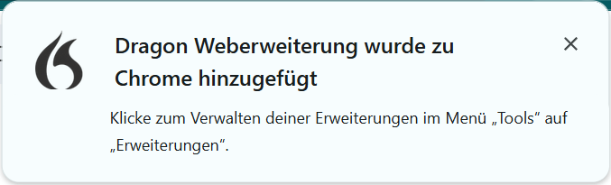

- Bestätigen Sie die folgende Abfrage mit der Schaltfläche „Erweiterung hinzufügen“.

- Die Dragon Weberweiterung wird im Microsoft Edge Browser installiert und Sie erhalten eine Bestätigung.

### Installation in Google Chrome

- Klicken Sie im Google Chrome-Browserfenster rechts oben auf das 3 Punkte Menü und wählen den Menüpunkt „Erweiterungen“. Im weiteren Popup klicken Sie auf den Link „Chrome Web Store besuchen“.

- Im Chrome Web Store geben Sie links oben in die Suche „Dragon DMO“ ein. Als Suchergebnis wird die Weberweiterung „Dragon (DMO, DMD, DPA, DLA) Web Extension“ angezeigt, klicken Sie dieses Suchergebnis an.

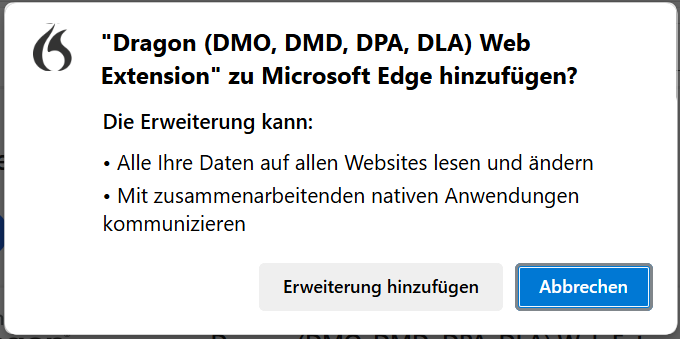

- Klicken Sie nun auf „Hinzufügen“.

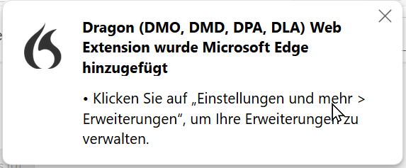

- Bestätigen Sie die folgende Abfrage mit der Schaltfläche „Erweiterung hinzufügen“.

- Die Dragon-Weberweiterung wird im Google Chrome Browser installiert und Sie erhalten eine Bestätigung.

# Nuance EHRi Web Extension – DMO Integration für web-basierte elektronische Gesundheitsaktensysteme wie Meditech und Athena

## Beschreibung des Add-On

- Version 3.24.0.7445, wurde aktualisiert 12. Februar 2024
- Die Nuance EHRI-Web-Erweiterung verbessert die Integration von Dragon in web-basierte (Chrome / Edge) elektronische Patientenakten-Systeme wie Meditech und Athena. Die Erweiterung wird von Dragon Medical One (DMO) verwendet, um den Workflow von Dragon Medical Advisor zu unterstützen. Wenn ein Arzt an einem EHR-System arbeitet, zeigt DMO auf der Grundlage der aktuellen Patienteninformationen und -dokumentation Ratschläge an, die den Ärzten helfen, die klinische Dokumentation zu verbessern. In diesem gesamten Arbeitsablauf wird die Nuance EHRi Web-Erweiterung zum Abrufen von Informationen aus dem EHR-System verwendet.
- Nuance EHRI Web Extension sollte automatisch aktualisiert werden. Wenn Ihr Unternehmen die Bereitstellung von Erweiterungen zentralisiert hat, wenden Sie sich an Ihren Administrator.
- Zweck dieser Erweiterung ist die Aktivierung und Unterstützung des Dragon Medical Advisor-Workflows für Chrome-basierte EMRs.

### Installation in Microsoft Edge

- Klicken Sie im Browserfenster von Edge rechts oben auf
  das 3 Punkte Menü (…) und wählen den Menüpunkt „Erweiterungen“.
- Es öffnet sich ein kleines Fenster, dort klicken Sie auf den Link „Erweiterungen für Microsoft Edge abrufen“

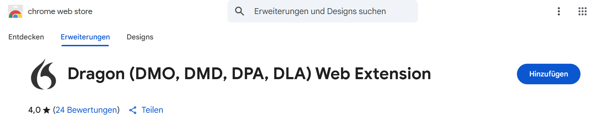

- Geben Sie auf der Microsoft Edge Add-Ons-Website in die Suche „Nuance EHRi“ ein.
- Als Suchergebnis wird die Weberweiterung „Nuance EHRi Web Extension“ angezeigt, klicken Sie dort auf die Schaltfläche „Abrufen“.

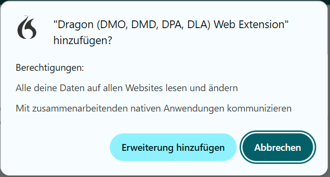

- Bestätigen Sie die folgende Abfrage mit der Schaltfläche „Erweiterung hinzufügen“.

- Die Nuance EHRi Weberweiterung wird in Edge installiert u. Sie erhalten eine Bestätigung.
-

### Installation in Google Chrome

- Klicken Sie im Google Chrome-Browserfenster rechts oben auf das 3 Punkte Menü und wählen den Menüpunkt „Erweiterungen“. Im weiteren Popup klicken Sie auf den Link „Chrome Web Store besuchhen“.

- Im Chrome Web Store geben Sie links oben in die Suche „Nuance EHRi“ ein. Als Suchergebnis wird die Weberweiterung „Nuance EHRi Web Extension“ angezeigt, klicken Sie dieses Suchergebnis an.

- Klicken Sie nun auf „Hinzufügen“.

- Bestätigen Sie die folgende Abfrage mit der Schaltfläche „Erweiterung hinzufügen“.

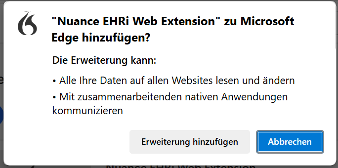

- Die Dragon Weberweiterung wird im Google Chrome Browser installiert und Sie erhalten eine Bestätigung.

# Kontakt

Sehr gerne stehen wir Ihnen bei weiteren Fragen zur Spracherkennung mit Nuance Dragon zur Verfügung.

|  |  |
| --- | --- |
| 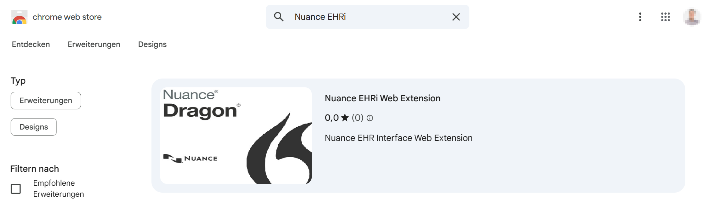 | Thax Software GmbH Halberstädter Str. 6 10711 Berlin Fon: +49 30 89064140 info@thax.de [https://www.thax.de](https://www.thax.de/) |